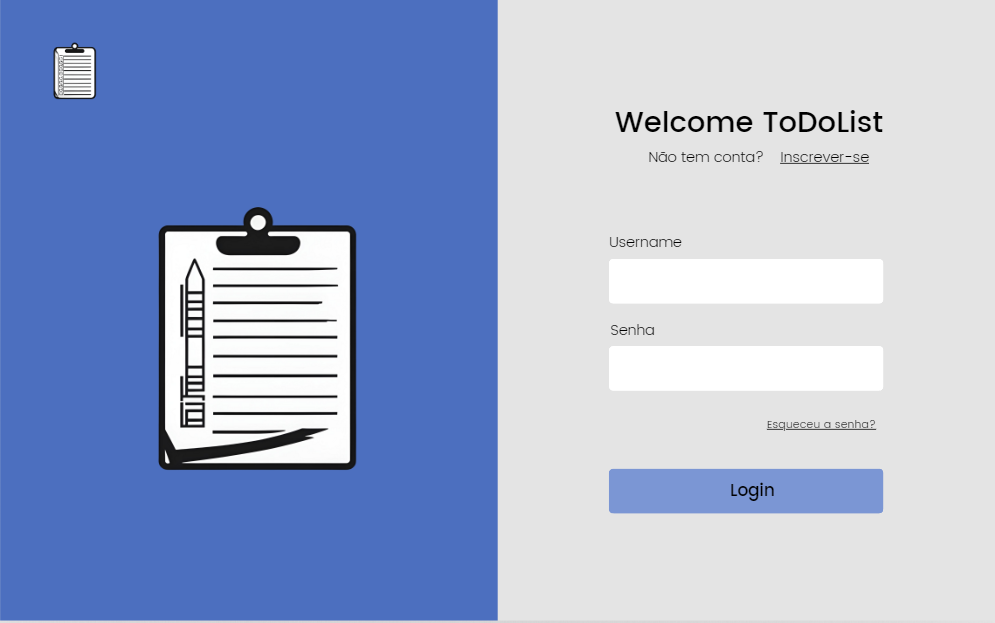
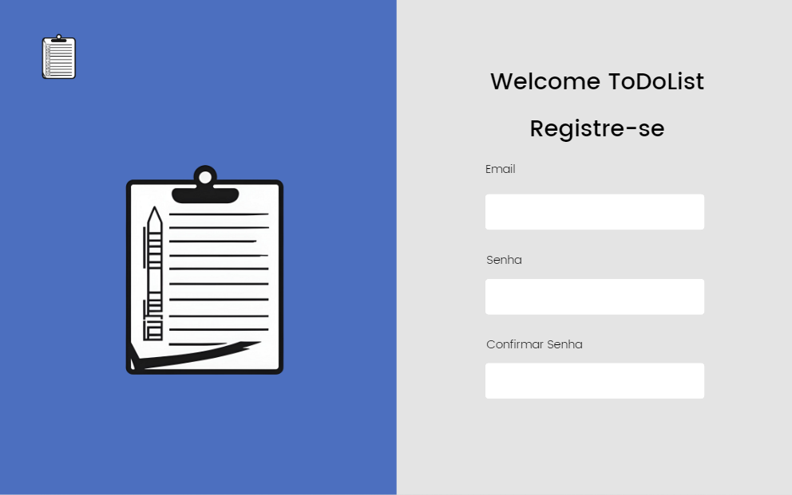
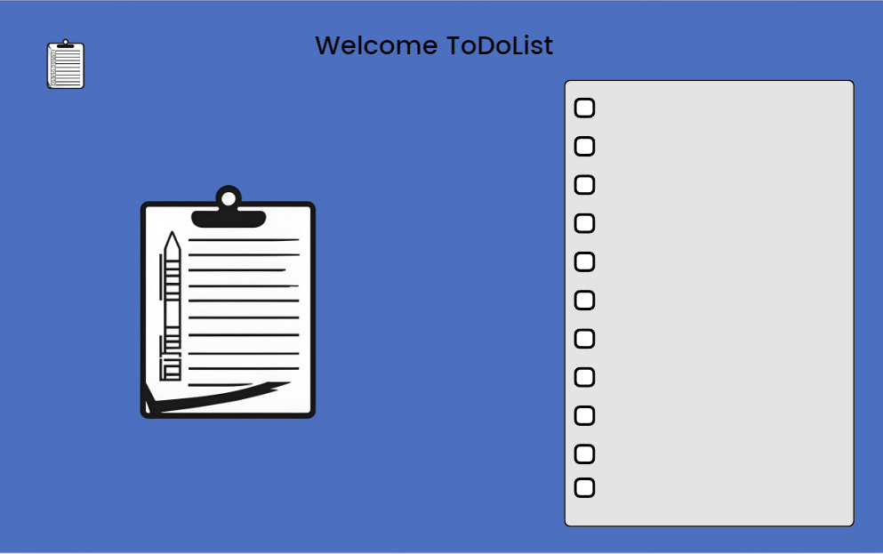

# Escopo do Projeto: Aplicação Web de To-Do List

## Objetivo

Desenvolver uma aplicação web de To-Do List utilizando tecnologias modernas e práticas de mercado, garantindo segurança, escalabilidade e uma experiência de usuário fluida. Este projeto é uma oportunidade de aplicar e aprimorar suas habilidades em React, Node.js, MongoDB, e JWT, criando uma solução completa e funcional que pode ser implementada no mundo real.

## O que Vamos Fazer

Vamos criar uma aplicação web que permita aos usuários gerenciar suas tarefas diárias de forma eficiente. A aplicação permitirá a criação, visualização, edição e exclusão de tarefas, além de oferecer recursos de autenticação e autorização para garantir que apenas usuários autenticados possam acessar e manipular suas próprias listas de tarefas.

## Escopo Funcional

1. **Autenticação e Autorização:**
   - Registro de novos usuários.
   - Login de usuários existentes.
   - Implementação de JWT para gerenciamento de sessões.

2. **Gerenciamento de Tarefas:**
   - Criação de novas tarefas.
   - Edição de tarefas existentes.
   - Exclusão de tarefas.
   - Marcação de tarefas como concluídas.
   - Filtros para visualizar tarefas por status (pendente, concluída).

3. **Interface do Usuário:**
   - Página inicial com lista de tarefas.
   - Formulário para adicionar e editar tarefas.
   - Página de login e registro.
   - Mensagens de erro e sucesso.

4. **Persistência de Dados:**
   - Armazenamento de dados no MongoDB.
   - Operações CRUD (Criar, Ler, Atualizar, Deletar) para tarefas e usuários.

5. **Segurança:**
   - Proteção contra ataques comuns (CSRF, XSS, SQL Injection).
   - Criptografia de senhas (utilizando bcrypt ou similar).

## Escopo Não Funcional

1. **Desempenho:**
   - Resposta do servidor em menos de 2 segundos para operações comuns.
   - Carregamento da página em menos de 3 segundos.

2. **Escalabilidade:**
   - Arquitetura que suporte a adição de novas funcionalidades com o mínimo de refatoração.
   - Capacidade de lidar com até 1.000 usuários simultâneos.

3. **Usabilidade:**
   - Design responsivo para diferentes tamanhos de tela (mobile, tablet, desktop).
   - Interface intuitiva e fácil de usar.

4. **Manutenção:**
   - Código modular e bem documentado.
   - Testes automatizados para garantir a integridade do sistema.

## Objetivos SMART

- **Específico:** Criar uma aplicação web de To-Do List com funcionalidades de CRUD e autenticação.
- **Mensurável:** Implementar todas as funcionalidades descritas no escopo funcional e não funcional.
- **Atingível:** Utilizar tecnologias que a equipe já conhece (React, Node.js, MongoDB, JWT).
- **Relevante:** Desenvolver uma aplicação que possa ser utilizada no mundo real, aplicando práticas de segurança e escalabilidade.
- **Temporal:** Completar o desenvolvimento da aplicação em 12 semanas.

## Cronograma

### Diagrama de Gantt

| Tarefa                                         | Duração  |    Início   |   Término   |
|------------------------------------------------|----------|-------------|-------------|
| Planejamento e Pesquisa                        | 1 semana | 01/09/2024  | 07/09/2024  |
| Design da Arquitetura                          | 1 semana | 08/09/2024  | 14/09/2024  |
| Configuração do Ambiente                       | 1 semana | 15/09/2024  | 21/09/2024  |
| Desenvolvimento Backend                        | 3 semanas| 22/09/2024  | 12/10/2024  |
| Desenvolvimento Frontend                       | 3 semanas| 13/10/2024  | 02/11/2024  |
| Integração Frontend e Backend                  | 2 semanas| 03/11/2024  | 16/11/2024  |
| Testes e Ajustes                               | 2 semanas| 17/11/2024  | 30/11/2024  |
| Documentação e Preparação para Lançamento      | 1 semana | 01/12/2024  | 07/12/2024  |
| Lançamento e Avaliação                         | 1 semana | 08/12/2024  | 14/12/2024  |

## Análise de Risco

1. **Risco de Atraso no Desenvolvimento:**
   - Mitigação: Planejamento detalhado e divisão clara de tarefas.

2. **Problemas de Segurança:**
   - Mitigação: Utilização de bibliotecas e práticas de segurança recomendadas.

3. **Dificuldades de Integração entre Frontend e Backend:**
   - Mitigação: Testes contínuos e comunicação clara entre as equipes.

4. **Problemas de Performance:**
   - Mitigação: Monitoramento de performance e otimização contínua.

## Recursos

- **Tecnologias:**
  - Frontend: React
  - Backend: Node.js
  - Banco de Dados: MongoDB
  - Autenticação: JWT
  - Ferramentas de Desenvolvimento: Git, Docker (opcional), ferramentas de CI/CD (opcional)

- **Equipe:**
  - Desenvolvedor Frontend
  - Desenvolvedor Backend
  - Designer (opcional)
  - Testador (opcional)

- **Orçamento:**
  - Desenvolvimento: X horas
  - Infraestrutura: Y reais

- **Materiais de Referência:**
  - Documentação das tecnologias utilizadas
  - Tutoriais e exemplos relevantes

--------------**DIAGRAMAS**------------------

**Diagrama de Classes**
## Diagramas

### Diagrama de Classes

classDiagram
    class User {
        - userId: String
        - username: String
        - password: String
        + register()
        + login()
        + logout()
    }

    class Task {
        - taskId: String
        - title: String
        - description: String
        - completed: Boolean
        + createTask()
        + updateTask()
        + deleteTask()
    }

    User -- Task : manages

**Diagrama de casos de uso**

usecaseDiagram
    actor User
    User --> (Register)
    User --> (Login)
    User --> (Logout)
    User --> (Create Task)
    User --> (Update Task)
    User --> (Delete Task)
    User --> (View Tasks)

**Diagrama de fluxo**

flowchart TD
    Start --> UserLogin
    UserLogin -->|Yes| AuthenticateUser
    UserLogin -->|No| ShowLoginPage
    AuthenticateUser --> CreateTask
    CreateTask --> SaveTaskToDB
    SaveTaskToDB --> ShowConfirmation
    ShowConfirmation --> End

