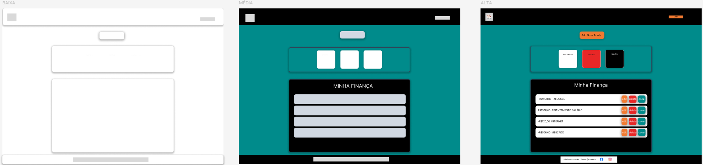

# Escopo do Projeto: Software de Gerenciamento Financeiro para Escritórios de Contabilidade

## Objetivo

Desenvolver um software para gerenciar e controlar os gastos mensais de um escritório de contabilidade. O objetivo é melhorar a eficiência na gestão financeira, aumentar a transparência e auxiliar na tomada de decisões financeiras. Utilizaremos tecnologias modernas para garantir segurança, escalabilidade e uma experiência de usuário fluida.

## O que Vamos Fazer

Vamos criar um sistema que permita aos usuários gerenciar suas finanças de forma eficiente, oferecendo recursos para o controle de despesas, receitas, relatórios financeiros e categorização de transações. A aplicação permitirá a criação, visualização, edição e exclusão de registros financeiros, além de oferecer recursos de autenticação e autorização para garantir que apenas usuários autorizados possam acessar e manipular suas finanças.

## Escopo Funcional

1. **Autenticação e Autorização:**
   - Registro de novos usuários e autenticação de usuários existentes.
   - Implementação de JWT para gerenciamento de sessões e permissões.
   - Perfis de usuário com diferentes níveis de acesso (administrador, gerente, contador).

2. **Gerenciamento Financeiro:**
   - **Despesas:**
     - Criação e categorização de despesas.
     - Edição e exclusão de despesas.
     - Visualização de despesas por categoria, data e valor.
   - **Receitas:**
     - Criação e categorização de receitas.
     - Edição e exclusão de receitas.
     - Visualização de receitas por categoria, data e valor.
   - **Relatórios:**
     - Geração de relatórios financeiros mensais e anuais.
     - Gráficos e visualizações de tendências de despesas e receitas.
     - Exportação de relatórios em formatos PDF e CSV.

3. **Interface do Usuário:**
   - Dashboard financeiro com visão geral das finanças.
   - Formulários para adicionar e editar despesas e receitas.
   - Página de relatórios e gráficos financeiros.
   - Página de login e perfil de usuário.
   - Mensagens de erro e sucesso.

4. **Persistência de Dados:**
   - Armazenamento de dados financeiros em um banco de dados relacional ou NoSQL.
   - Operações CRUD (Criar, Ler, Atualizar, Deletar) para transações e usuários.

5. **Segurança:**
   - Proteção contra ataques comuns (CSRF, XSS, SQL Injection).
   - Criptografia de dados sensíveis e senhas (utilizando bcrypt ou similar).
   - Controle de acesso baseado em funções.

## Escopo Não Funcional

1. **Desempenho:**
   - Resposta do servidor em menos de 2 segundos para operações comuns.
   - Carregamento da página em menos de 3 segundos.

2. **Escalabilidade:**
   - Arquitetura que suporte a adição de novas funcionalidades com o mínimo de refatoração.
   - Capacidade de lidar com até 500 usuários simultâneos.

3. **Usabilidade:**
   - Design responsivo para diferentes tamanhos de tela (mobile, tablet, desktop).
   - Interface intuitiva e fácil de usar, com navegação clara e acessível.

4. **Manutenção:**
   - Código modular e bem documentado.
   - Testes automatizados para garantir a integridade do sistema e facilitar a manutenção.

## Objetivos SMART

- **Específico:** Criar um software para gerenciamento financeiro com funcionalidades de controle de despesas, receitas e relatórios.
- **Mensurável:** Implementar todas as funcionalidades descritas no escopo funcional e não funcional.
- **Atingível:** Utilizar tecnologias que a equipe já conhece (por exemplo, React, Node.js, MongoDB, JWT).
- **Relevante:** Desenvolver uma aplicação que atenda às necessidades específicas de gerenciamento financeiro para escritórios de contabilidade.
- **Temporal:** Completar o desenvolvimento da aplicação em 16 semanas.

## Cronograma

### Diagrama de Gantt

| Tarefa                                         | Duração  |    Início   |   Término   |
|------------------------------------------------|----------|-------------|-------------|
| Planejamento e Pesquisa                        | 2 semanas| 01/10/2024  | 14/10/2024  |
| Design da Arquitetura                          | 2 semanas| 15/10/2024  | 28/10/2024  |
| Configuração do Ambiente                       | 2 semanas| 29/10/2024  | 11/11/2024  |
| Desenvolvimento Backend                        | 4 semanas| 12/11/2024  | 09/12/2024  |
| Desenvolvimento Frontend                       | 4 semanas| 10/12/2024  | 06/01/2025  |
| Integração Frontend e Backend                  | 2 semanas| 07/01/2025  | 20/01/2025  |
| Testes e Ajustes                               | 3 semanas| 21/01/2025  | 10/02/2025  |
| Documentação e Preparação para Lançamento      | 2 semanas| 11/02/2025  | 24/02/2025  |
| Lançamento e Avaliação                         | 1 semana | 25/02/2025  | 03/03/2025  |

## Análise de Risco

1. **Risco de Atraso no Desenvolvimento:**
   - Mitigação: Planejamento detalhado e divisão clara de tarefas, revisões semanais de progresso.

2. **Problemas de Segurança:**
   - Mitigação: Utilização de bibliotecas e práticas de segurança recomendadas, revisão de código e auditorias de segurança.

3. **Dificuldades de Integração entre Frontend e Backend:**
   - Mitigação: Testes contínuos e comunicação clara entre as equipes de desenvolvimento.

4. **Problemas de Performance:**
   - Mitigação: Monitoramento de performance e otimização contínua, uso de técnicas de caching e balanceamento de carga.

## Recursos

- **Tecnologias:**
  - Frontend: React
  - Backend: Node.js
  - Banco de Dados: MongoDB (ou SQL)
  - Autenticação: JWT
  - Ferramentas de Desenvolvimento: Git, Docker (opcional), ferramentas de CI/CD (opcional)

- **Equipe:**
  - Desenvolvedor Frontend
  - Desenvolvedor Backend
  - Designer (opcional)
  - Testador (opcional)

- **Materiais de Referência:**
  - Documentação das tecnologias utilizadas
  - Tutoriais e exemplos relevantes

## Diagramas

### Diagrama de Classe

### Diagrama de Casos de Uso

### Diagrama de Fluxo

### Prototipagem

